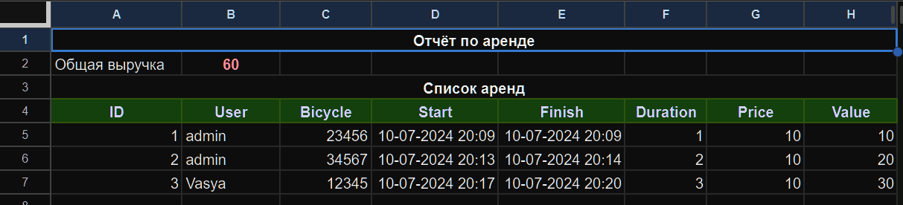

# API service


Сервис аренды велосипедов (тестовое задание). 
Реализованы эндпоинты для регистрации и аутентификации пользователей, 
получение списка доступных велосипедов, аренды и возврата велосипедов. 
Авторизованный пользователь может получить историю своих аренд. Подключен эмулятор 
почтового сервера. Расчёт стоимости аренды и отправка сообщения пользователю 
реализованы с использованием брокера Celery. Также формируется отчёт в google-таблицах:


## Автор:
Алексей Наумов ( algena75@yandex.ru )
## Используемые технолологии:
* Django
* PostgreSQL
* Docker
* Celery
* Redis
* Nginx
* Swagger
* MinIO
* Google Sheets
## Как запустить проект:
Клонировать репозиторий и перейти в него в командной строке:


```
git clone git@github.com:Algena75/picasso_II.git
```

```
cd picasso_II
```

### Запуск виртуального окружения

Создание виртуального окружения:
```bash
poetry env use python3.10
```
Установка зависимостей:
```bash
poetry install --with test
```
Запуск оболочки и активация виртуального окружения (из папки проекта):
```bash
poetry shell
```
Проверка активации виртуального окружения:
```bash
poetry env list
```
## Подготовка:
Создать в корне проекта файл `.env` (см `.env.example`) для подключения БД, хранилища S3, 
и интеграции с Google Sheet. Если не указать в файле `.env` ID таблицы, то таблица будет создана. 
ID таблицы можно посмотреть в логах `docker container logs picasso_ii-worker-1`. Таблица доступна 
по адресу ` https://docs.google.com/spreadsheets/d/{ID таблицы} `.


## Как запустить проект локально:
* #### для запуска проекта в контейнерах выполнить:
    ```bash
    docker compose -f docker-compose.yml up -d
    ```
    открыть в браузере ` http://127.0.0.1/api/docs `. Суперпользователь для доступа
    в админку (` http://127.0.0.1/admin `) уже создан. Для доступа используйте 
    email=admin@admin.ru и пароль qwerty. Для тестирования в БД созданы 4 велосипеда. 
    Добавить можно через админку.
* #### для запуска проекта в терминале перейти в директорию `backend` и выполнить:
    - в одном терминале:

    выполнить миграции и заполнить базу данных
    ```bash
    python3 manage.py migrate
    python3 manage.py loaddata dump.json
    ```
    запустить сервер
    ```bash
    python3 manage.py runserver
    ```
    - во втором терминале 
    ```bash
    celery -A backend worker --loglevel=info --concurrency 1 -E
    ```
    открыть в браузере http://127.0.0.1:8000/api/docs
## Автотесты:
Написаны тесты для тестирования основной функциональности сервиса. 
Для запуска тестов выполнить в терминале `pytest`.
